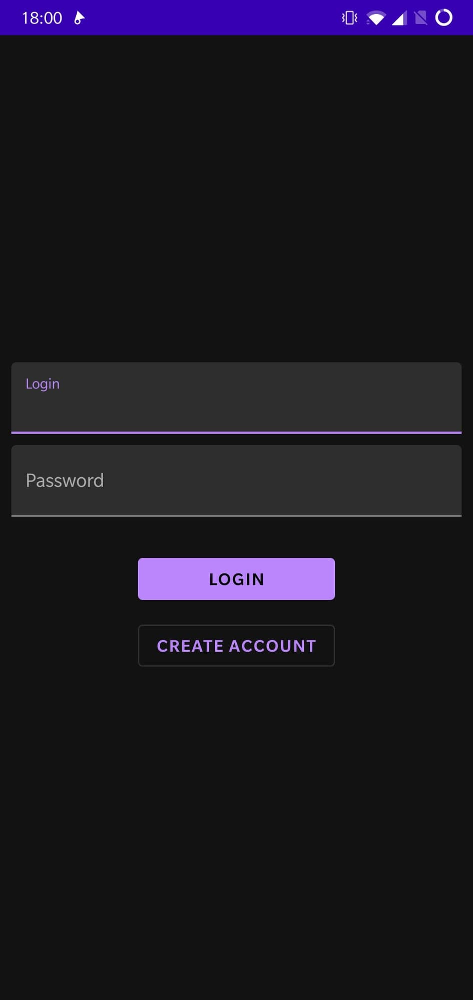
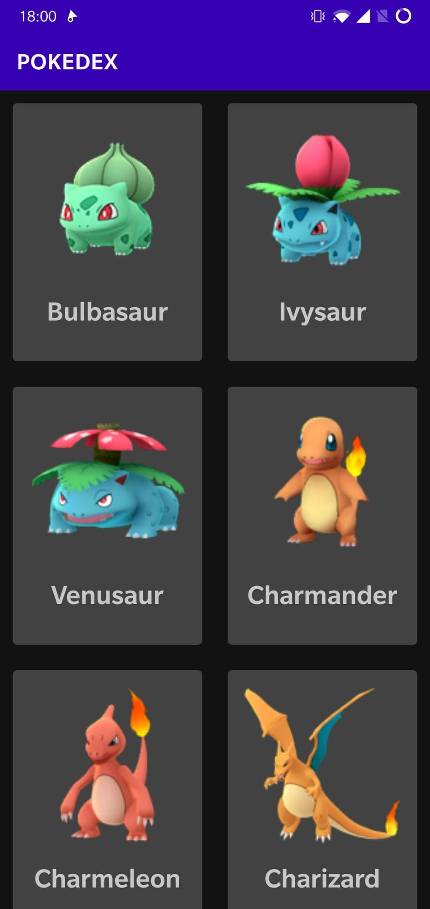
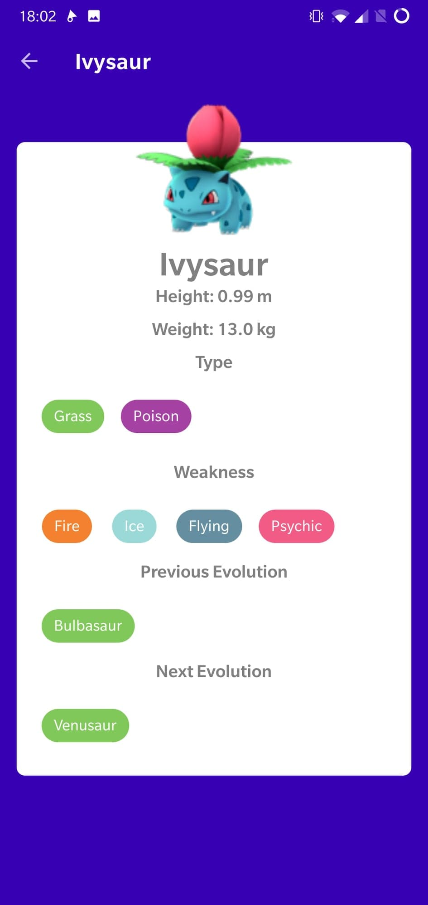
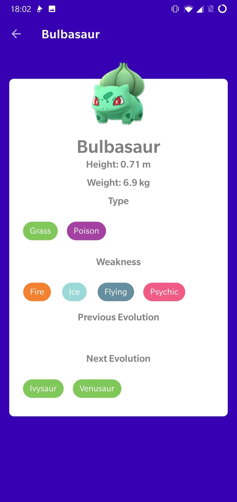
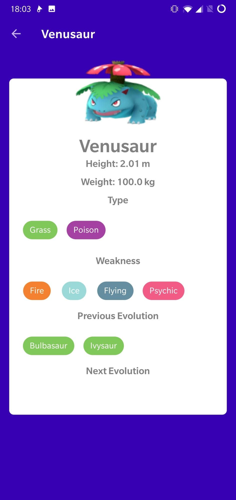

# Android4A

## Présentation

Projet de programmation mobile de 4A, c'est une application android codé en Kotlin.
Elle permet grâce à une API d'affiché différent Pokemon.
On peut aussi séléctionner un pokemon afin de faire apparaître à l'écran des informations le concernant

## Consigne minimale :

  - Language Kotlin / Swift si iOS
  - Architecture MVVM
  - Clean Architecture
  - Utilisation d’une réelle BDD
  - Utilisation Api REST
  - Affichage d’une liste
  - Design

## Ajout :

  - Affichage du détail des éléments de la liste
  - Mode Sombre (sauf affichage des informations du pokemon)
  - Gitflow rudimentaire

## L'application :

### Premier écran

  - Ecran de connexion, il est possible de créer un compte ou de se connecter si on en possède déjà un.
    - Si, lors de la connexion, la combinaison Login/Password on obtient une erreur
    - Si, lors de la création de compte, le login est déjà utilisé on obtient une erreur

### Second écran

  - Une fois connecté, on obtient une liste de pokemon

  - Si l'on se risque à appuyé sur un pokémon on obtient des informations complémentaires sur ce dernier.
  

  
  - Sur cette page, on peut :
    - Retourner en arrière en appuyant sur la flèche en haut à droite.
    - Allez voir une évolution précédentes (si il en existe) en appuyant sur le nom de l'évolution
    - Ou encore, allez voir une évolution suivantes (toujours si il en existe) en appuyant sur le nom de l'évolution

